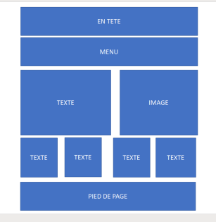
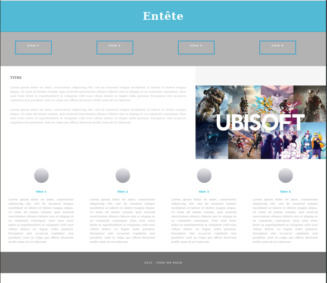
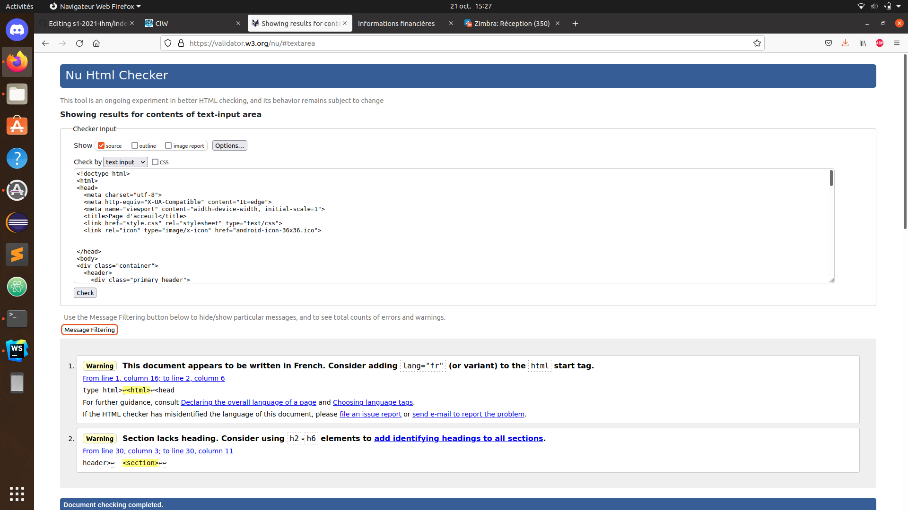
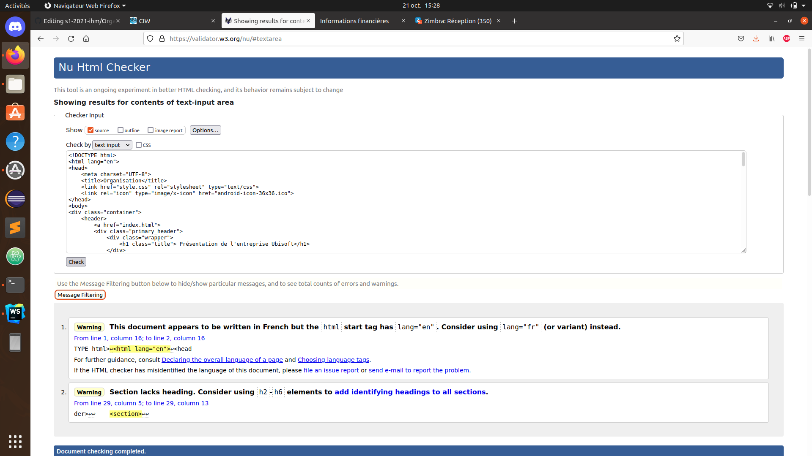
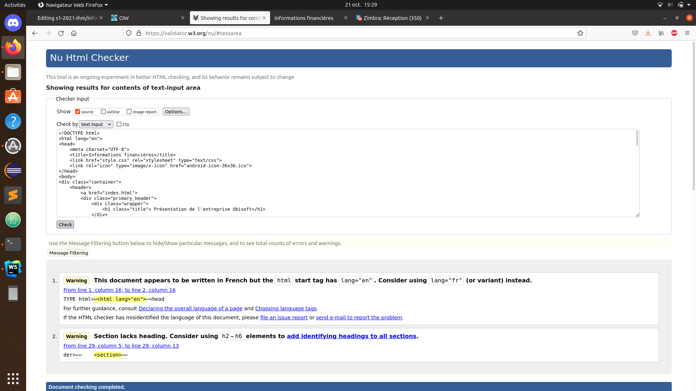

# s1-2021-ihm

Présentation de Ubisoft
groupe C2
NICOD Simon ; Gaetan JOBST ; Adrien LE GOUSSE

# Livrable parties Économie et Documents numérique
[écran prototype](doc/C2_NICOD_JOBST_LEGOUSSE.pdf)

On a tout d'abord réalisé un écran de zoning qui servira de modèle à notre page d'acceuil
Celui ci a été réalisé par Adrien 

On a ensuite transposé ce modèle en html et rajouté quelques styles pour que la forme nous convienne
Fait par Adrien et Simon

Nous utiliserons le même fichier css pour toutes les pages afin que le site soit homogène.

Le css a été en grande partie faite par Simon.
Nous nous sommes répartis le travail sur la page d'acceuil.

Chaque personne a ensuite rédigé une page de notre site. 
Adrien a fait la page sur les services rendus, Gaetan sur l'organisation et Simon sur les informations financières.

Toutes les pages ont été vérifiées au validateur W3C : 

Page d'acceuil : 

Page 1 : 

Page 2 :

Page 3 :

